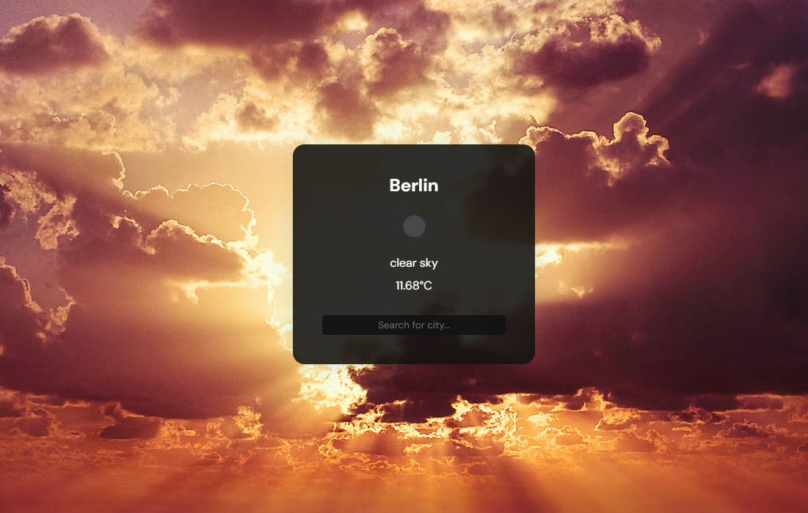

# Weather App

This app provides current weather information using the OpenWeatherMap API and geocoding API.  Users can enter a location to view the current weather conditions.

## Live Site

Check out the live site [here](https://weather-app-axmst.netlify.app/).

## Built With

- [React](https://reactjs.org/) - JavaScript library for building user interfaces
- [OpenWeatherMap API](https://openweathermap.org/api) - Provides weather data and forecasts
- [Geocoding API](https://openweathermap.org/api/geocoding-api) - Converts location data into geographic coordinates

## Getting Started

To get a local copy up and running, follow these steps:

1. Clone the repository: `git clone https://github.com/your-username/weather-app.git`
2. Navigate to the project directory: `cd weather-app`
3. Install dependencies: `npm install`
4. Start the development server: `npm start`
5. Open [http://localhost:3000](http://localhost:3000) in your browser to view the app

## Contributing

Contributions are welcome! If you have any ideas, suggestions, or improvements, please open an issue or submit a pull request.
